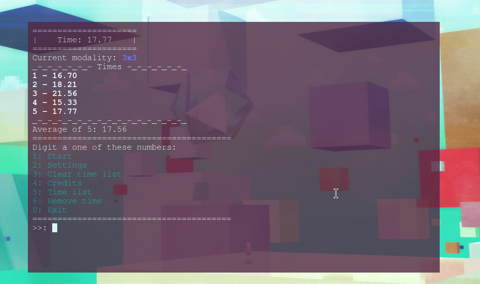

---
---
## What is it?


CanUseTimer is an open source, writed in Python, speedcubing, multiplatform
timer created to work in a terminal or command prompt window. Because 
this the program is soft and run anywhere, it means that it can run in 
probally any computer with bad hardware and any operating system
(Windows, Linux and MacOS X). And It's Open Source project, it means that
you can install it for free and study the source code of program if you want.

In future I will create a grafical
interface based on it, but I don't know a good grafical interface
framework to use in my project, but probally this will take a long
time. If you know a good grafical interface framework please tell me
in a [Issue](https://github.com/Samuel-de-Oliveira/CanUseTimer/discussions/categories/issues)

> ℹ️ Note: Dont tell me about TKinter, I've tried it and went wrong.

## Can I contribute to project?
Yes, you can! I will verify your issue or pull request, and if I like the ideia, I will implement in my software. So don't be shy to share something good.

- Comment a [Issue](https://github.com/Samuel-de-Oliveira/CanUseTimer/discussions/categories/issues)
- Create a [pull request](https://github.com/Samuel-de-Oliveira/CanUseTimer/pulls)

---
## Release notes 🗒️
### [Stable](#stable) 0.2.2 :white_check_mark:
- Time list recieved a upgrade:
  - Now the times can be saved when the user exit of software;
  - Time list is now parallel for each modality.
- windows installer now is real;
- Bug fixes.

### [Unstable](#unstable) :construction:
- No unstable version for now

---
## Install
### Stable
The stable version is the most recommended to install in your machine
because there's less bugs, have installers for all systems and you
don't need know about programing and Python to run it.

**Install**

Chose your Operating system:
|System|Latest version|File|
| :- | :- | :-: |
|Windows| 0.2.2 | [CanUseTimer-v0.2.2-Windows_Setup.exe](https://github.com/Samuel-de-Oliveira/CanUseTimer/releases/download/0.2.2/CanUseTimer-v0.2.2-Windows_Setup.exe) |
|Linux| 0.2.2 | [CanUseTimer-v0.2.2-Linux.tar.xz](https://github.com/Samuel-de-Oliveira/CanUseTimer/releases/download/0.2.2/CanUseTimer-v0.2.2-Linux.tar.xz) |
|Mac OS| - Comming soon ||

Old Versions [here.](https://github.com/Samuel-de-Oliveira/CanUseTimer/releases/)

### Unstable
The unstable version is a version that is in constant development
and you can see new features constantly, but this version may come
with bugs of new implementations, recommended only if you want to
check what is comming and test it.

> :warning: This type of version only have Linux installer (Because
the deeveloper uses Linux).

**Install**

To get the unstable version you only need to clone this repository
with:

```sh
git clone https://github.com/Samuel-de-Oliveira/CanUseTimer.git
cd CanUseTimer
```

after this you can run it with python or (if you use Linux) install
using the file `install.sh`. To update (Any system) type `git pull`
and install it again.

**Run from source**

But if you don't want to install you can run directly from source
using Python. To do this process you need install python 3.10 or higher
with pip, after install you need to install the requirements using `pip
install -r requirements.txt` or `pip3 install -r requirements.txt`.

Then you can run with this command in your terminal:

	python Main.py

> :information_source: Use a Python virtual environmet, beacuse the
unstable version can make comflicts with you python libraries. to
create one type `python -m venv env` in the project folder.

<!--
---
## I want to know more about...
If you want to know more about how to configure or do something in the
software, you need to read the [wiki](https://github.com/samuel-de-oliveira/CanUseTimer/wiki)
to learn more, have wiki for every OS. If you want to help with something
you can make forks or report errors in github issues, you will help a
lot :wink:.

Also check our website: [**Fast link!**](https://samuel-de-oliveira.github.io/CanUseTimer-Web/)
-->
---
## Why use?
- Lightweight program (Almost 1MB of space on Linux and 7MB for Windows);
- Run all platforms (Windows, Linux :penguin:);
- Don't need internet (but you can't update it);
- Open source (Read the GPLv3 licensse for more info). 🔓 

---
## Disclaimers! ⚠️
- This is the terminal version, without grafical interface;
- This program is tested only in Linux and Windows, and not else;
- this is a BETA version, this means that the final version is on progress;
- If you found bugs please report to fast fixing in Github issues.

---
---

##### Created by: *Samuel de Oliveira 2021 - 2024*
